# NodateDebug
Building an STM32CubeIDE debug environment for a NoDate project

I've been fascinated by small, low-overhead libraries for developing software on STM32 platforms.  Lately I've been working with Maya Posch's NoDate library.  Unfortunately, I'm not very good at using gdb and really like graphical IDEs for debugging.  So these are my ideas for integrating a NoDate makefile project into a STM32Cube IDE debug environment.  Props to https://github.com/ethanhuanginst/STM32CubeIDE-Workshop-2019 for the crucial basic steps.  Note that the instructions that follow were developed for use on Linux.  Some modification may be required for use with Windows or MacOS.

## Steps

0. Preparations
   * Install the NoDate library and set the required environment variables.  Test the installation by compiling one of the included examples.
   * Install the STM32CubeIDE environment.

1. Start a new STM32 project
   
   * Select "Help -->Information Center":  
     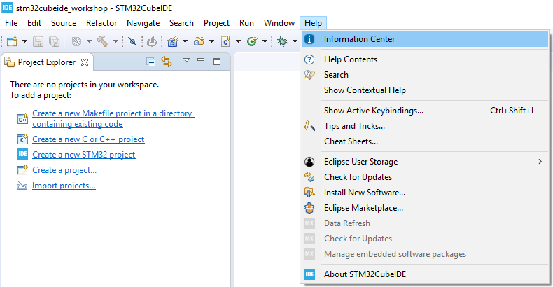
   
     
   
   * Press "Start new STM32 project":
     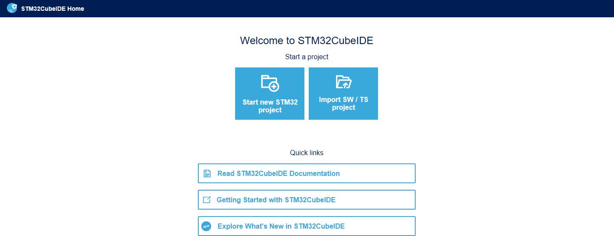
   * Select "32F746DISCOVERY" board from "Board Selector" and press "Next" button:  
     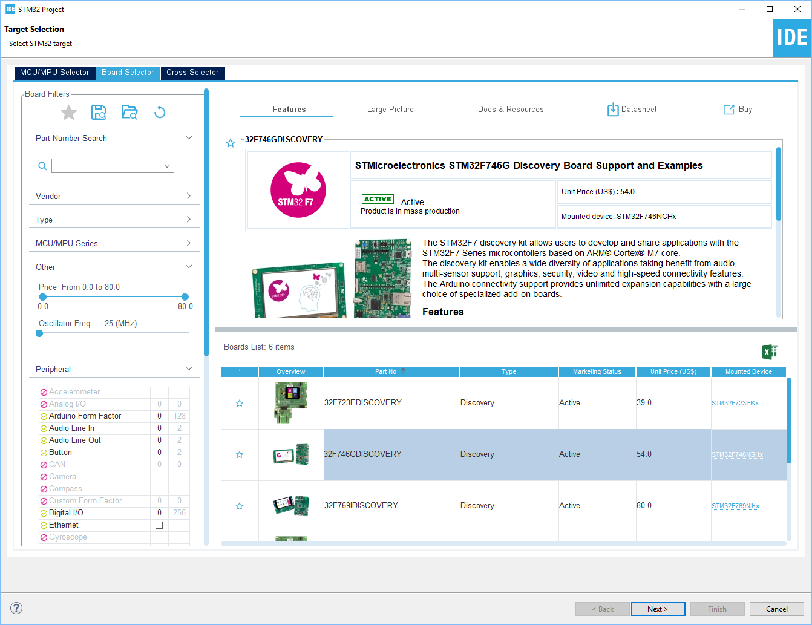
   * Assign "Project Name" and "Location", and make sure "Targeted Project Type" is "Empty". Press "Finish" button when all is set.  
     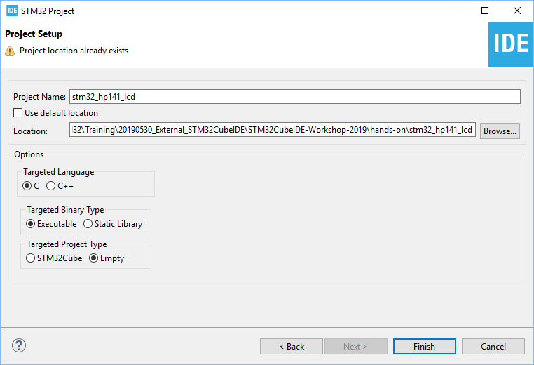
   
5. Prepare for compiling   
   * Delete all folders and files:  
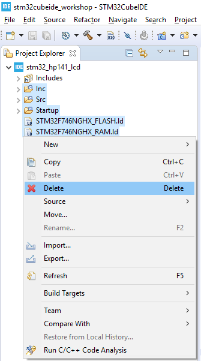
   * Drag all "stm32_hp141_lcd" file (except out.elf) and folders into "stm32_hp141_lcd" in Project Exploere of STM32CubeIDE:  
     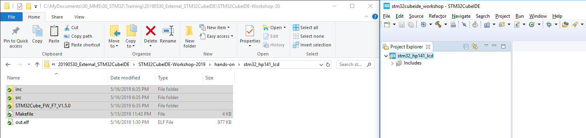
   * Select "Copy files and folders" and then press "OK":
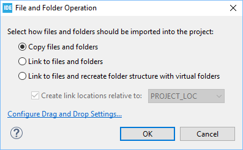
   
8. Compile the code
   
   * Select "Properties":  
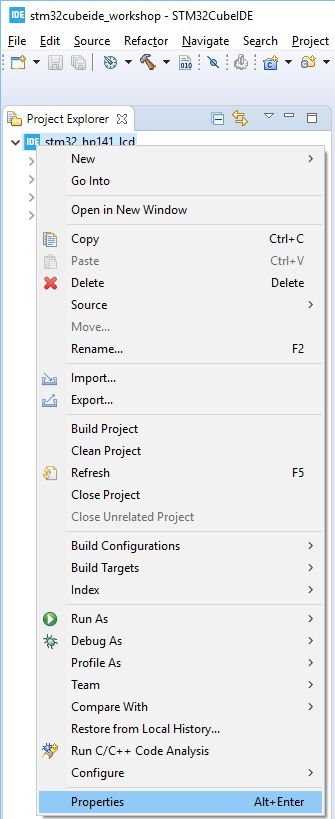
   
   * Modify "Builder Settings" (uncheck "Generate Makefiles automatically" and delete string "Debug" in Build directory) as shown below:  
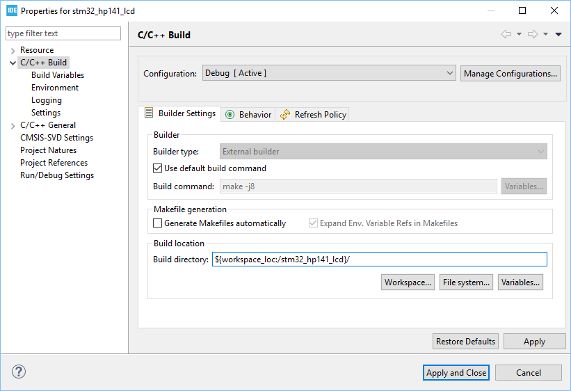
     
   * Select "Build Project":  
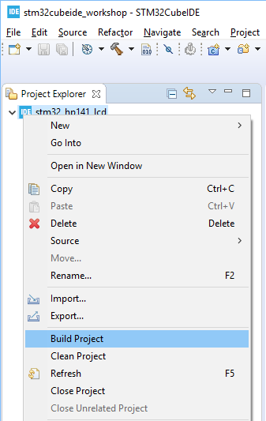
     
     

11. Start debug

    * Select "Debug As --> STM32 MCU C/C++ Application"  
    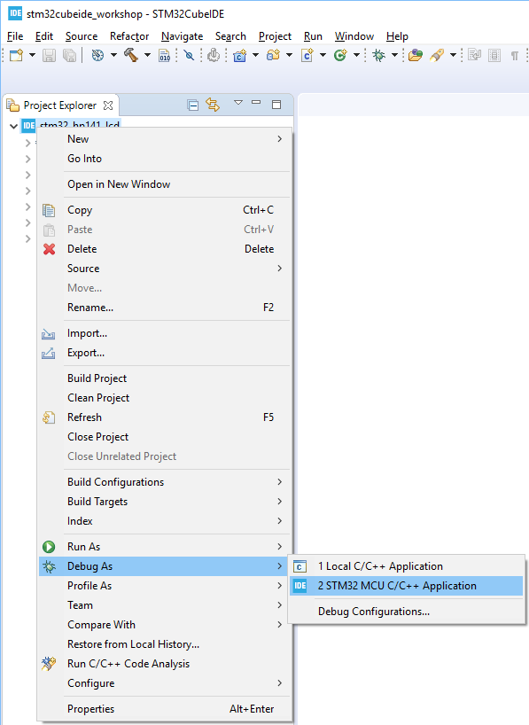
    * Press "OK" button in "Edit Configuration":  
    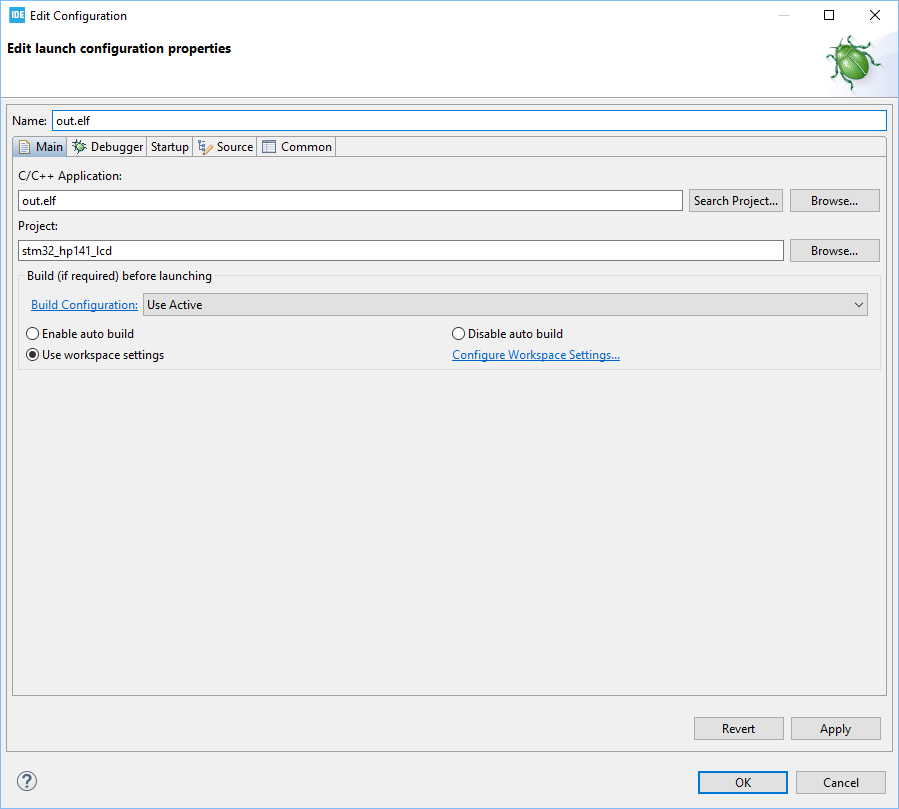
    * Press "Resume" button to run the code:  
    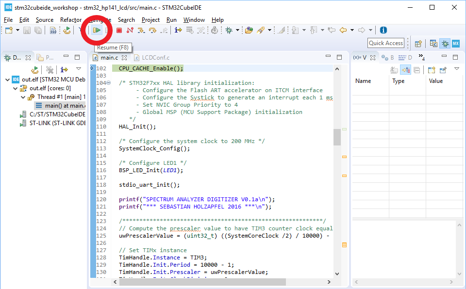
